# finalCapstone
Software Engineering Task 21 Part 2

## Project Description
This project was a task to incorporate all the Python programming techniques which were taught on the software engineering bootcamp course @HyperionDev including functions, input and output of files and create a Task Manager.

The task was to create functions and add functionality to a legacy solution of Task_manager.py. The task manager after logging in allows the users login and register with a username and password. The program allows users to 

* add tasks
* view all tasks
* view and edit the current user's tasks
* generate summary reports
* create a default admin account
* allow admin only access to display statistics

## Installation

To use this program you must have Python v3.11 installed on your computer and you should have access to code editor such MS Visual Code to run the code. 

To install this project please copy task_manager.py and the program will create 2 empty input .txt files tasks.txt and users.txt in the same folder on the initial run.

* task_manager.py  - contains all the python code required
* user.txt         - contains username and password details
* tasks.txt        - contains task details including
  * name
  * task_id
  * description,
  * assignment date
  * completed flag

## Usage

### Login
1. Run the file task_manager.py file in the Python editor or Python CMD shell
2. A default admin account is created with
   * username = admin
   * password = password
3. The program then gives the option to enter username or -1 to register or e to exit
   Initially login as admin and enter the credentials as per step 2

   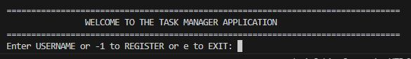
4. Once logged in you will presented with the main menu with the options

   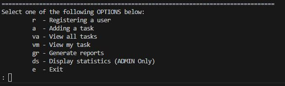
5. To select an option enter the letter for the desired option for example to register a user enter r and follow the onscreen instructions as below:

   

   After selecting any option you will be always returned to the main menu

### Add a task
1. From the main menu enter a
2. Follow the onscreen prompts as below, please remember username is case sensitive

   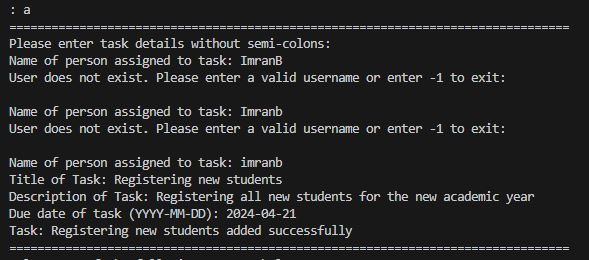

### View all tasks
1. From the main menu enter va
2. All details of all tasks will be outputted
 
   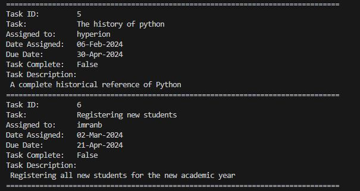

### View my tasks
1. From the main menu enter vm
2. All details of all tasks belonging to the current user will be shown
   
   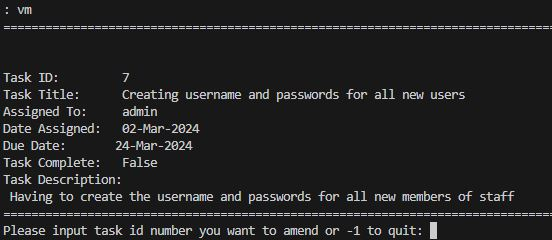
   
4. Then there will be an option given to amend a task by giving the task_id or returning to the main menu
5. If a task is to be amended you can do this by following the onscreen prompts you have options to:
   * mark is as completed
   * change the user it has been assigned to (the username must exist already)
   * change the due date
     
   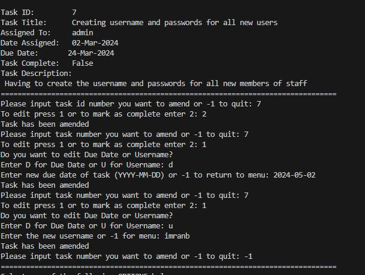

   The amended task

   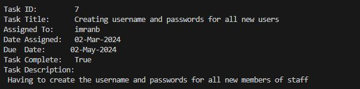 

### Generate Reports

This report allows the user to create two output files in the same folder as the task_manager.py file.

user_overview - gives summary on the amount of users and tasks and then a summary of each users current task status including completion and overdue tasks. Please see screenshot below for the completed steps if you want to amend and mark complete.

  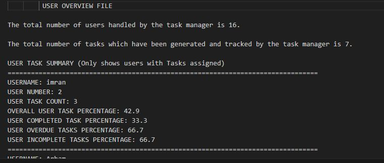

task_overview.txt - gives the following details
For example:

* The total number of tasks which have been generated and tracked by the task manager is 7.
* The total number of completed tasks is 2.
* The total number of incomplete tasks is 5.
* The total number of incomplete and overdue tasks are 3.
* The percentage of tasks that are incomplete is 71.4%.
* The percentage of tasks that are overdue is 42.9%.

### Display statistics

Display statistics allows the admin to view all details which are contained in the two file user.txt and tasks.txt to be displayed on screen.

User output

  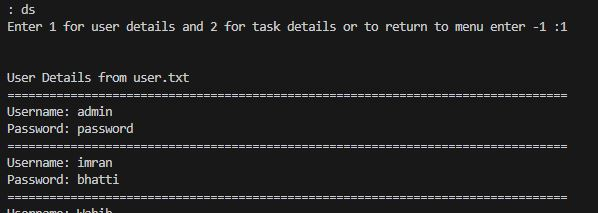

Task output

  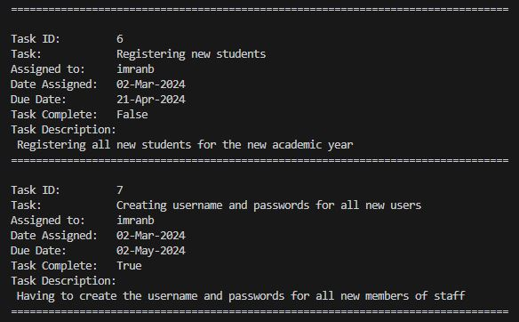

### Exit the Task Manager

To exit from the main menu please enter e on the main menu, you will be asked to confirm after confirmation you will exit.

  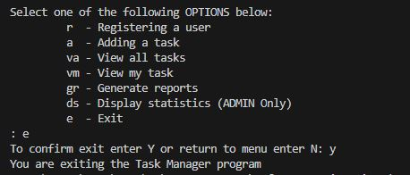

### Credits

Imran Bhatti Jan 2024

HyperionDev Software Engineering Bootcamp course (Nov 2023 - Mar 2024)
